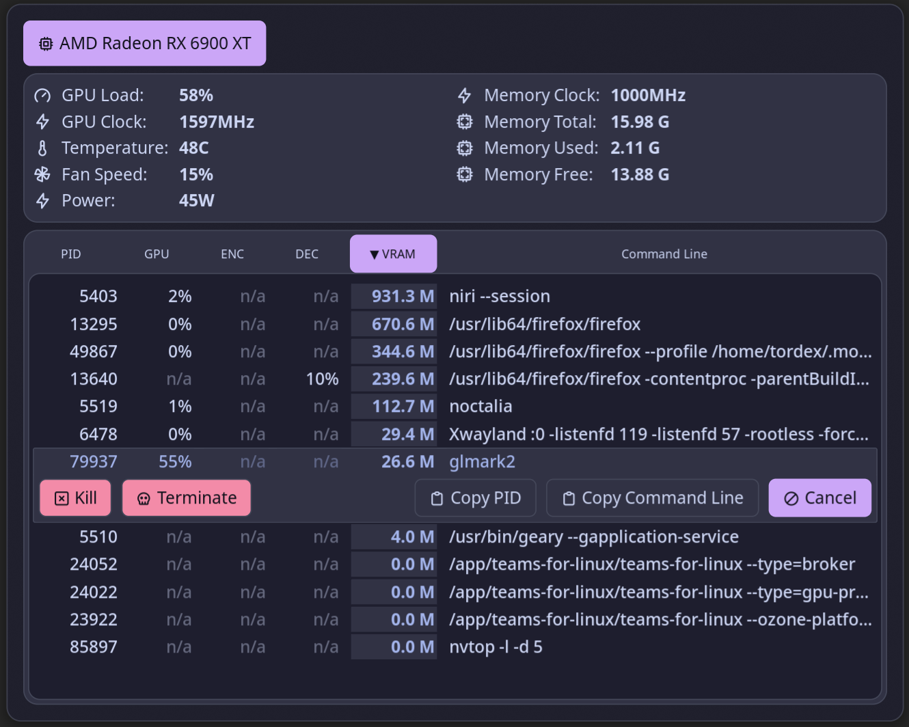

# NVTOP

Monitor real-time information about your GPU status and running processes with nvtop.

# Features

* Uses `nvtop` to monitor real-time GPU status.
* Supports multiple GPUs.
* View processes using the GPU.
* Process columns: **PID**, **GPU Usage**, **Video Encoder Usage**, **Video Decoder Usage**, **GPU Memory Usage**, and **Command Line**.
* Sort processes by any column by clicking its header.
* Kill a process with SIGINT or terminate it with SIGKILL.
* Copy a process PID or command line to the clipboard.
* Customizable polling interval.
* Customizable colors for the sorted column.
* The plugin launches `nvtop` when the panel opens and closes it when the panel is closed. This helps save resources.



## Plugin

| Field | Value |
| --- | --- |
| ID | `tordex/nvtop` |
| Entries | Panel: `panel` |

## Requirements

The plugin requires `nvtop`, `jq`, `kill`, and `pkill` to be installed and available in `$PATH`.

## Usage

You can open the panel by binding it in your compositor or by setting the action for `sysmon` widgets:


```toml
[widget.GPU_Usage]
stat = "gpu_usage"
type = "sysmon"

    [widget.GPU_Usage.actions]
    left = "panel-toggle tordex/nvtop:panel gpu"

[widget.GPU_VRAM]
stat = "gpu_vram_used"
type = "sysmon"

    [widget.GPU_VRAM.actions]
    left = "panel-toggle tordex/nvtop:panel mem"
```

To open the panel from the command line, use:

```sh
noctalia msg panel-toggle tordex/nvtop:panel [order_by]
```

Possible values for `order_by`:

| `order_by` value | Effect |
| --- | --- |
| `pid` | Sort by Process ID (PID) |
| `gpu` | Sort by GPU Usage |
| `enc` | Sort by Video Encoder Usage |
| `dec` | Sort by Video Decoder Usage |
| `mem` | Sort by GPU Memory Usage |
| `cmd` | Sort by Process Command Line |

Without `order_by`, the panel opens with the previous sort mode.

Add `-` before `order_by` to reverse the sort order. For example:

```sh
noctalia msg panel-toggle tordex/nvtop:panel -mem
```

Note: some GPUs share an encoder/decoder. In this case, the `ENC` and `DEC` columns are replaced by a single `ENC/DEC` column. The `order_by` values `enc` and `dec` still work, and both sort processes by the `ENC/DEC` column.


## Settings

| Setting | Type | Default | Description |
| --- | --- | --- | --- |
| `delay` | `int` | `5` | Refresh rate. `1` == `0.1s`. Valid values: `1-20`. |
| `sort_column_background` | `color` | `surface_variant` | Background color for the sorted column. |
| `sort_column_color` | `color` | `on_surface_variant` | Text color for the sorted column. |
| `process_hover_background` | `color` | `surface_variant` | Background color for the hovered row. |
| `process_hover_color` | `color` | `on_surface_variant` | Text color for the hovered row. |

