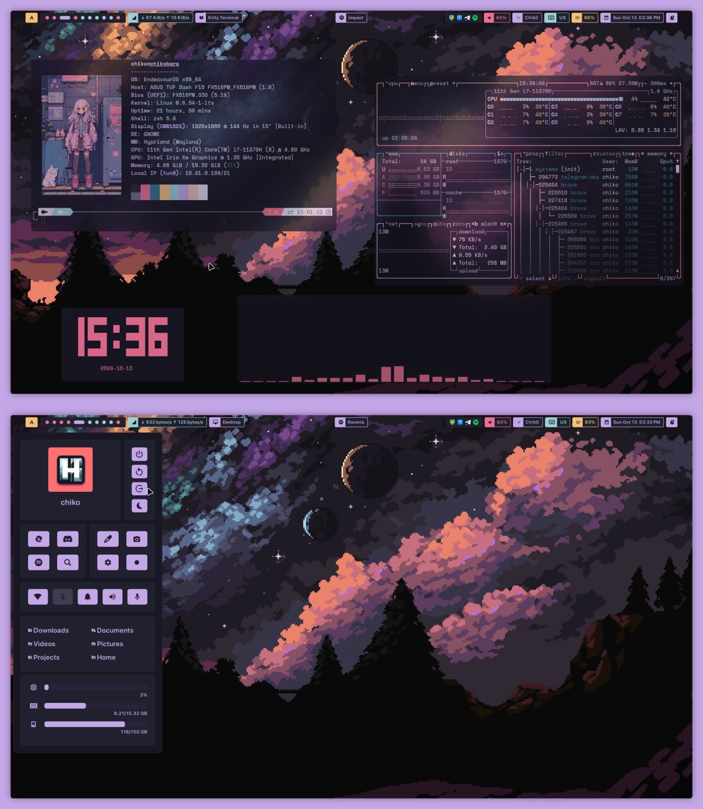

    <h1>Dotfiles</h1>

# My awesome dotfiles

Arch Linux with Hyprland dotfiles

### Tools used

- **Window Manager** • [Hyprland](https://github.com/hyprwm/Hyprland)🎨 Tiles
  Everywhere!
- **Shell** • [Zsh](https://www.zsh.org) 🐚
- **Terminal** • [Kitty](https://github.com/kovidgoyal/kitty) 💻 A powerful term
  with gpu support!
- **Panel** • [Hyprpanel](https://github.com/Jas-SinghFSU/HyprPanel)🍧 A Bar/Panel for Hyprland with extensive customizability.
- **Notify Daemon** • ~~[Dunst](https://github.com/dunst-project/dunst) 🍃
  Minimalist and functional!~~ was\  its hyprpanel now handling the notifications
- **Launcher** • [Rofi](https://github.com/davatorium/rofi) 🚀 A window switcher, application launcher and dmenu replacement
- **File Manager** • [yazi](https://github.com/sxyazi/yazi)🔖 💥 Blazing fast terminal file manager written in Rust, based on async I/O.
- **GUI Basic-IDE** • [NvChad](https://github.com/NvChad/NvChad) Rice
  IDE!

    

    <h2>• screenshots •</h2>
    
    

## Keybind Table

Note: Some keybindings may be hidden or have alternatives. This table includes the primary visible keybindings from the configuration file.

#### Table of Contents

1. [Essentials](#essentials)
2. [Actions](#actions)
3. [Session Management](#session-management)
4. [Window Management](#window-management)
5. [Workspace Navigation](#workspace-navigation)
6. [Workspace Management](#workspace-management)
7. [Widgets](#widgets)
8. [Media Controls](#media-controls)
9. [Application Shortcuts](#application-shortcuts)

  
Here is a table with all keybinding

| Category | Keybind | Action |
|----------|---------|--------|
| **Essentials** |
| | Super + R | Launch terminal (kitty) |
| | Ctrl + Super + T | Change wallpaper |
| **Actions** |
| | Super + V | Open clipboard history |
| | Super + Period | Open emoji picker |
| | Super + Shift + S | Take a screenshot (screen snip) |
| | Shift + Alt + S | Take a screenshot and open in editor |
| | Super + Shift + T | OCR: Screen snip to text |
| | Super + Shift + C | Pick color (Hex) |
| | Print | Full screenshot to clipboard |
| | Ctrl + Print | Full screenshot to file |
| | Super + Alt + R | Record region (no sound) |
| | Super + Shift + Alt + R | Record screen (with sound) |
| **Session Management** |
| | Super + L | Lock session |
| | Super + Shift + L | Suspend system |
| | Ctrl + Shift + Alt + Super + Delete | Power off |
| **Window Management** |
| | Super + Arrow Keys | Move focus in direction |
| | Super + Q | Close active window |
| | Super + Shift + Alt + Q | Pick and kill a window |
| | Super + Shift + Arrow Keys | Move window in direction |
| | Super + +/- | Adjust window split ratio |
| | Super + Alt + P | Toggle floating |
| | Super + Alt + F | Toggle fake fullscreen |
| | Super + F | Toggle fullscreen |
| | Super + D | Toggle fullscreen (preserve gaps) |
| **Workspace Navigation** |
| | Super + [1-0] | Switch to workspace 1-10 |
| | Ctrl + Super + Left/Right | Focus left/right workspace |
| | Super + Mouse Wheel | Focus left/right workspace |
| | Super + Page Up/Down | Focus left/right workspace |
| **Workspace Management** |
| | Super + Alt + [1-0] | Move window to workspace 1-10 |
| | Ctrl + Super + Shift + Left/Right | Move window to left/right workspace |
| | Super + Shift + Mouse Wheel | Move window to left/right workspace |
| | Super + Alt + Page Up/Down | Move window to left/right workspace |
| | Super + P | Pin window (stays visible on all workspaces) |
| **Widgets** |
| | Ctrl + Super + R | Restart widgets |
| | Ctrl + Alt + / | Cycle bar mode |
| | Super (hold) | Toggle overview/launcher |
| | Super + / | Show cheatsheet |
| | Super + A | Toggle dashboard menu |
| | Super + S | Toggle energy menu |
| | Super + M | Toggle media menu |
| | Super + N | Toggle notifications menu |
| | Ctrl + Alt + Delete | Toggle power menu |
| | Ctrl + Super + G | Toggle crosshair |
| **Media Controls** |
| | Super + Shift + N | Next track |
| | Super + Shift + B | Previous track |
| | Super + Shift + P | Play/pause media |
| **Application Shortcuts** |
| | Super + T | Launch terminal (foot) |
| | Super + Z | Launch Zed (editor) |
| | Super + C | Launch VSCode |
| | Super + E | Launch file manager (nemo) |
| | Ctrl + Super + W | Launch Firefox |
| | Super + X | Launch GNOME Text Editor |
| | Super + Shift + W | Launch WPS Office |
| | Super + I | Launch GNOME Settings |
| | Ctrl + Super + V | Launch pavucontrol (volume mixer) |
| | Ctrl + Super + Shift + V | Launch EasyEffects |
| | Ctrl + Shift + Escape | Launch GNOME System Monitor |
| | Ctrl + Super + / | Toggle fallback launcher (anyrun) |
| | Super + Alt + / | Toggle fallback launcher (fuzzel) |

## Dependencies

## ToDo

- [ ] writedown the dependecies
- [ ] make an installer script
- [X] write the keybind table guide

     
     
    

        <h2>• thanks to  •</h2>
    

- [Jas-SinghFSU](https://github.com/Jas-SinghFSU/) for making [Hyprpanel](https://github.com/Jas-SinghFSU/HyprPanel)
- [Aylur](https://github.com/Aylur/) for making [ags](https://github.com/Aylur/ags)
- [end-4](https://github.com/end-4) for ags scripts and other hyprland [configs](https://github.com/end-4/dots-hyprland)
- [adil090x](https://github.com/adi1090x/) for [rofi themes](https://github.com/adi1090x/rofi)
- r/Unixporn and many others for inspiration! <3
