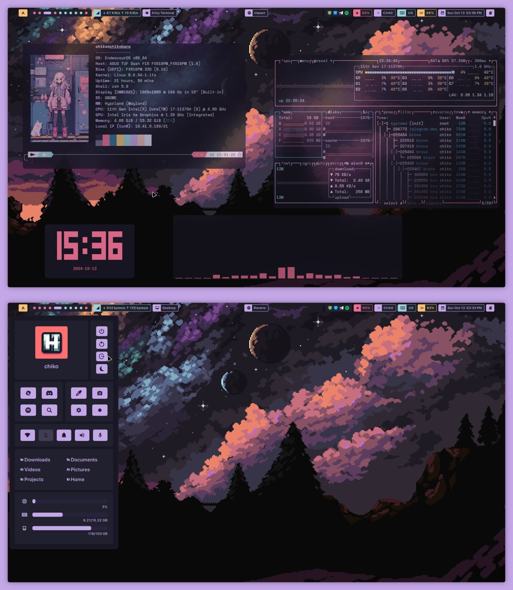

<div align="center">
    <h1>🎇 Dotfiles 🎇</h1>
</div>

# Table of Contents
- [Table of Contents](#table-of-contents)
- [Tools used](#tools-used)
- [Shell migration](#shell-migration)
- [Keybind Table](#keybind-table)
  - [Essentials](#essentials)
  - [Actions](#actions)
  - [Session Management](#session-management)
  - [Window Management](#window-management)
  - [Workspace Navigation](#workspace-navigation)
  - [Workspace Management](#workspace-management)
  - [Widgets](#widgets)
  - [Media Controls](#media-controls)
  - [Application Shortcuts](#application-shortcuts)

# Tools used

- **Window Manager** • [Hyprland](https://github.com/hyprwm/Hyprland)🎨 Tiles
  Everywhere!
- **Shell** • [Zsh](https://www.zsh.org) 🐚
- **Terminal** • [Kitty](https://github.com/kovidgoyal/kitty) 💻 A powerful term
  with gpu support!
- **Panel + shell** • [Noctalia](https://github.com/noctalia-dev/noctalia) 🍧 A native Wayland desktop shell for Hyprland with bars, launcher, notifications, wallpaper, OSD, and control-center surfaces.
- **Notify Daemon** • Noctalia notifications and OSD
- **Launcher** • Noctalia launcher, with [Fuzzel](https://codeberg.org/dnkl/fuzzel) as a lightweight fallback
- **Phone integration** • [KDE Connect](https://kdeconnect.kde.org/) daemon and tray indicator
- **File Manager** • [yazi](https://github.com/sxyazi/yazi)🔖 💥 Blazing fast terminal file manager written in Rust, based on async I/O.
- **GUI Basic-IDE** • [NvChad](https://github.com/NvChad/NvChad) Rice
  IDE!

## Shell migration

The default session now starts Noctalia v5 with `noctalia --daemon`. On EndeavourOS/Arch, install it with:

```bash
sudo pacman -S noctalia
```

Noctalia is now the only shell started by Hyprland. The removed legacy AGS/HyprPanel, Rofi, and wlogout configuration is kept in a recoverable migration snapshot under `~/.local/state/chiko-dotfiles-backups/`.

<div align='center'>
    <div align="center">
    <h2>🍙• Screenshots •🍙</h2>
    
    </div>
</div>

<br/>
<br/>

# Keybind Table

Note: Some keybindings may be hidden or have alternatives. This table includes the primary visible keybindings from the configuration file.

## Essentials
| Keybind | Action |
|---------|--------|
| Super + R | Launch terminal (kitty) |
| Ctrl + Super + T | Open Noctalia wallpaper picker |

## Actions
| Keybind | Action |
|---------|--------|
| Super + V | Open Noctalia clipboard history |
| Super + Period | Open Noctalia emoji search |
| Super + Shift + S | Take an annotated screenshot |
| Shift + Alt + S | Save and copy a selected screenshot |
| Super + Shift + T | OCR: Screen snip to text |
| Super + Shift + C | Pick color (Hex) |
| Print | Full screenshot to clipboard |
| Ctrl + Print | Full screenshot to file |
| Super + Alt + R | Record region (no sound) |
| Super + Shift + Alt + R | Record screen (with sound) |

## Session Management
| Keybind | Action |
|---------|--------|
| Super + L | Lock session with Noctalia |
| Super + Shift + L | Suspend system |
| Ctrl + Shift + Alt + Super + Delete | Power off |

## Window Management
| Keybind | Action |
|---------|--------|
| Super + Arrow Keys | Move focus in direction |
| Super + Q | Close active window |
| Super + Shift + Alt + Q | Pick and kill a window |
| Super + Shift + Arrow Keys | Move window in direction |
| Super + +/- | Adjust window split ratio |
| Super + Alt + P | Toggle floating |
| Super + Alt + F | Toggle fake fullscreen |
| Super + F | Toggle fullscreen |
| Super + D | Toggle fullscreen (preserve gaps) |

## Workspace Navigation
| Keybind | Action |
|---------|--------|
| Super + [1-0] | Switch to workspace 1-10 |
| Ctrl + Super + Left/Right | Focus left/right workspace |
| Super + Mouse Wheel | Focus left/right workspace |
| Super + Page Up/Down | Focus left/right workspace |

## Workspace Management
| Keybind | Action |
|---------|--------|
| Super + Alt + [1-0] | Move window to workspace 1-10 |
| Ctrl + Super + Shift + Left/Right | Move window to left/right workspace |
| Super + Shift + Mouse Wheel | Move window to left/right workspace |
| Super + Alt + Page Up/Down | Move window to left/right workspace |
| Super + P | Pin window (stays visible on all workspaces) |

## Widgets
| Keybind | Action |
|---------|--------|
| Ctrl + Super + R | Restart Noctalia |
| Ctrl + Alt + / | Toggle Noctalia bar |
| Super + Tab | Open Noctalia launcher |
| Super + A | Open Noctalia control center |
| Super + S | Open Noctalia power tab |
| Super + M | Open Noctalia media tab |
| Super + N | Open Noctalia notifications tab |
| Ctrl + Alt + Delete | Open Noctalia session menu |

## Media Controls
| Keybind | Action |
|---------|--------|
| Super + Shift + N | Next track |
| Super + Shift + B | Previous track |
| Super + Shift + P | Play/pause media |

## Application Shortcuts
| Keybind | Action |
|---------|--------|
| Super + T | Launch terminal (foot) |
| Super + Z | Launch Zed (editor) |
| Super + C | Launch VSCode |
| Super + E | Launch file manager (nemo) |
| Ctrl + Super + W | Launch Firefox |
| Super + X | Launch GNOME Text Editor |
| Super + Shift + W | Launch WPS Office |
| Super + I | Launch GNOME Settings |
| Ctrl + Super + V | Launch pavucontrol (volume mixer) |
| Ctrl + Super + Shift + V | Launch EasyEffects |
| Ctrl + Shift + Escape | Launch GNOME System Monitor |
| Ctrl + Super + / | Open Noctalia launcher |
| Super + Alt + / | Toggle fallback launcher (fuzzel) |

---


<div align='center'>
    <br/>
    <br/>
    <div align="center">
        <h2>• thanks to  •</h2>
    </div>
</div>

- [Noctalia maintainers](https://github.com/noctalia-dev/noctalia) for the current shell foundation
- r/Unixporn and many others for inspiration! <3
